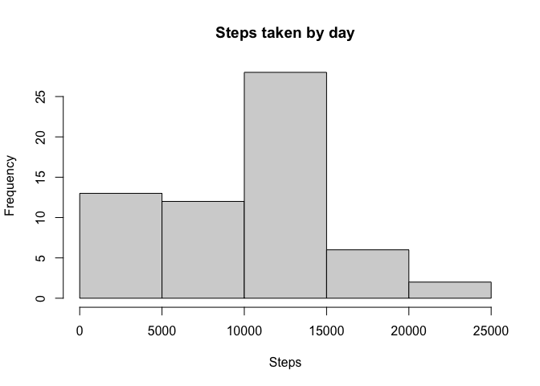
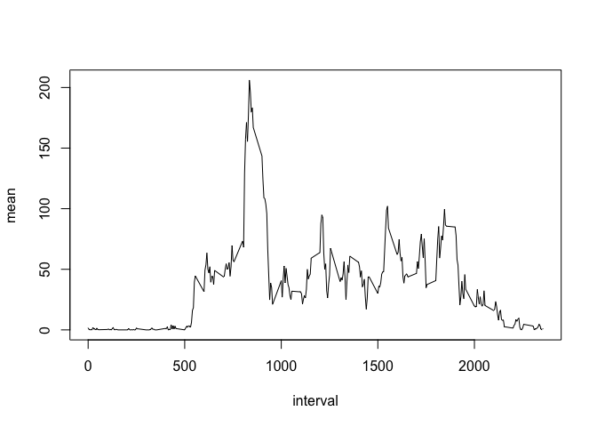
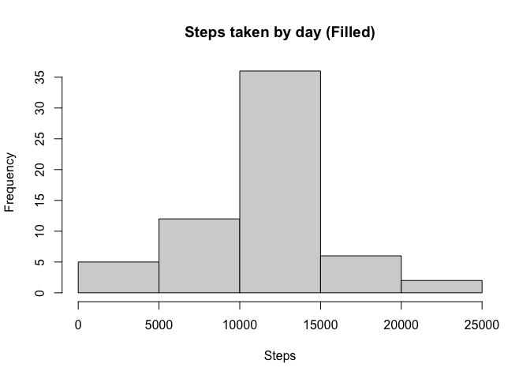
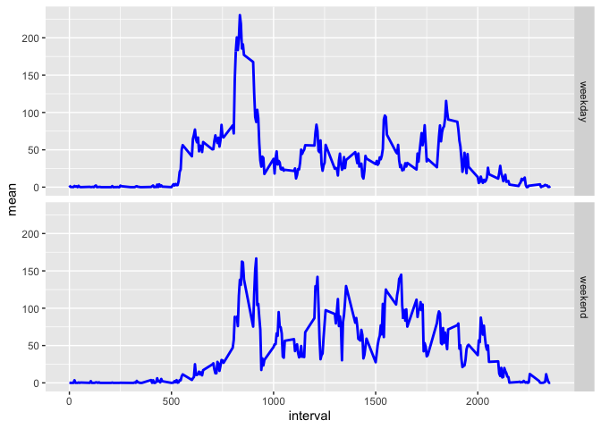

```r
knitr::opts_chunk$set(fig.path="figures/")
```

## Loading and preprocessing the data

```r
data <- read.csv(unz("activity.zip", "activity.csv"))
```


## What is mean total number of steps taken per day?
Histogram of the number of steps taken by day:

```r
library(dplyr)
```

```
## 
## Attaching package: 'dplyr'
```

```
## The following objects are masked from 'package:stats':
## 
##     filter, lag
```

```
## The following objects are masked from 'package:base':
## 
##     intersect, setdiff, setequal, union
```

```r
total_by_day <- data %>% group_by(date) %>%
  summarise(total = sum(steps, na.rm = TRUE))
hist(total_by_day$total, main = "Steps taken by day", xlab = "Steps")
```

<!-- -->

Mean of the steps taken for day:

```r
mean(total_by_day$total, na.rm=TRUE) 
```

```
## [1] 9354.23
```
Median of the steps taken for day:

```r
median(total_by_day$total, na.rm=TRUE) 
```

```
## [1] 10395
```

## What is the average daily activity pattern?
Daily pattern of steps taken by interval:

```r
steps_by_interval <- data %>% group_by(interval) %>%
  summarise(mean = mean(steps, na.rm = TRUE))
with(steps_by_interval, plot(interval, mean, type="l"))
```

<!-- -->

Interval with the max average of steps:

```r
max(steps_by_interval$mean, na.rm = TRUE) 
```

```
## [1] 206.1698
```


## Imputing missing values
Number of rows with NA values:

```r
data %>% 
  filter(is.na(steps)) %>%
  nrow()
```

```
## [1] 2304
```
Generation of a new subset without NA values, we use the average steps of that 
interval to fill and we check there is no NA rows

```r
new_data <- data %>% transform(steps=ifelse(is.na(steps), steps_by_interval[steps_by_interval["interval"]==interval,]$mean, steps))
new_data %>% 
  filter(is.na(steps)) %>%
  nrow()
```

```
## [1] 0
```
A new histogram with the filled values

```r
new_total_by_day <- new_data %>% group_by(date) %>%
  summarise(total = sum(steps, na.rm = TRUE))
hist(new_total_by_day$total, main = "Steps taken by day (Filled)", xlab = "Steps")
```

<!-- -->

New mean of the steps taken for day:

```r
mean(new_total_by_day$total, na.rm=TRUE) 
```

```
## [1] 10766.19
```
New median of the steps taken for day:

```r
median(new_total_by_day$total, na.rm=TRUE) 
```

```
## [1] 10766.19
```
The values differ from the original values, and they obviously they have gone up
since they were discarded from the total previously, and counted as zero.

## Are there differences in activity patterns between weekdays and weekends?

Creates a new variable to differentiate *weekday* and *weekend*


```r
weekday_dataset <- new_data %>%
  transform(dayType=
              ifelse(grepl("S(at|un)", weekdays(as.Date(date), abbreviate = TRUE)), 
                     "weekend", "weekday")) %>%
  group_by(interval, dayType) %>%
  summarise(mean = mean(steps))
```

```
## `summarise()` has grouped output by 'interval'. You can override using the `.groups` argument.
```
Plot the two different panels:

```r
library(ggplot2)
base <- ggplot(data = weekday_dataset, 
               aes(x = interval, y = mean), ylab="Number of Steps")
base <- base + geom_line(color = "blue", size = 1)
base + facet_grid(dayType ~ .,)
```

<!-- -->

There is a slightly difference on patterns, on weekdays people are more active on
a specific time of the day meanwhile on the weekend people are more active the 
entire day
